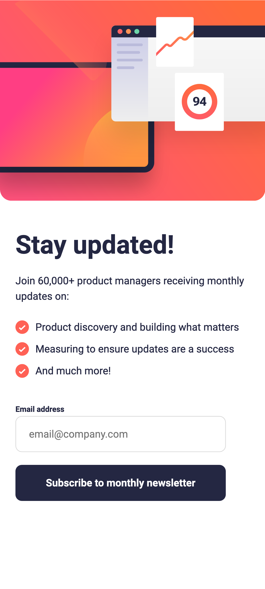

# Frontend Mentor - Newsletter sign-up form with success message solution

This is a solution to the [Newsletter sign-up form with success message challenge on Frontend Mentor](https://www.frontendmentor.io/challenges/newsletter-signup-form-with-success-message-3FC1AZbNrv). Frontend Mentor challenges help you improve your coding skills by building realistic projects.

## Table of contents

- [Overview](#overview)
  - [The challenge](#the-challenge)
  - [Screenshot](#screenshot)
  - [Links](#links)
- [My process](#my-process)
  - [Built with](#built-with)
  - [What I learned](#what-i-learned)
  - [Continued development](#continued-development)
  - [Useful resources](#useful-resources)
- [Author](#author)
- [Acknowledgments](#acknowledgments)

## Overview

### The challenge

Users should be able to:

- Add their email and submit the form
- See a success message with their email after successfully submitting the form
- See form validation messages if:
  - The field is left empty
  - The email address is not formatted correctly
- View the optimal layout for the interface depending on their device's screen size
- See hover and focus states for all interactive elements on the page

### Screenshot

### Links

- Solution URL: [News Letter App Component](https://github.com/mayor-creator/news_letter_app_component)
- Live Site URL: [Add live site URL here](https://your-live-site-url.com)

## My process

### Built with

- Semantic HTML5 markup
- CSS custom properties
- Flexbox
- CSS Grid
- Mobile-first workflow
- [React](https://reactjs.org/) - JS library

### What I learned

<Input
className={
editEmail && !isValidEmail ? "error-message-input" : ""
}
label="Email address"
id="email"
name="email"
placeholder="<email@company.com>"
required
type="email"
value={email}
onChange={handleEmailChange}
/>

- Using the ternary operator in className was helpful in understanding how to apply logic to css class properties in react.

### Continued development

- Testing React Apps (unit test)
- Handling Error Message in React
- Tailwind CSS with React

### Useful resources

- [How to Use React Context in Your Project – Beginner's Guide](https://www.freecodecamp.org/news/how-to-use-react-context/) - This helped me for understanding React Context API. The examples in this article was great to follow and detail explanation was good.

- [CSS GRADIENT GENERATOR](https://www.css-gradient.com/) - This is an amazing tool for generating linear gradient background.

## Author

- Frontend Mentor - [@mayor-creator](https://www.frontendmentor.io/profile/mayor-creator)
- Threads - [@mayor_creator](https://www.threads.net/@mayor_creator)

## Acknowledgments
